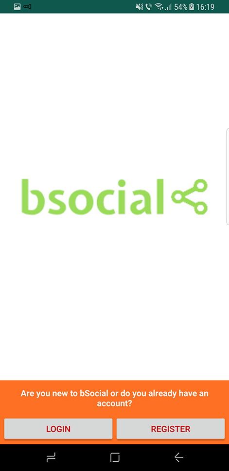
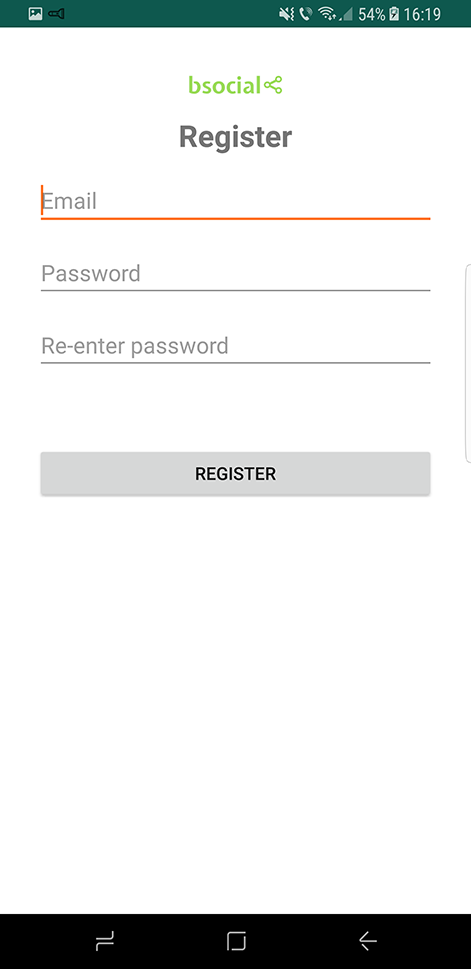
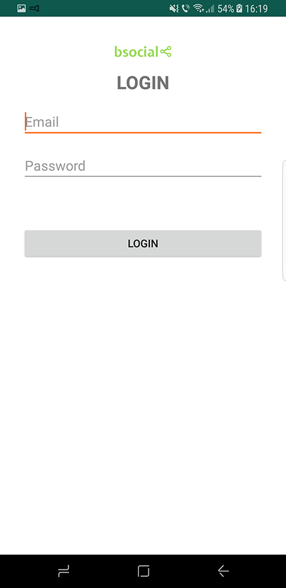

# bSocial-android

bSocial is a realtime chat app.

Bachelor project, the android part

This project tries to use the latest technologies, libraries and architectures:
  - kotlin
  - RxJava2
  - RxKotlin
  - MVP
  - Dagger2
  - Retrofit2
  - Auto-Factory
  - Glide
  - Dart/Henson
  - IcePick
  - Gson
  - LeakCanary

# Screenshots

